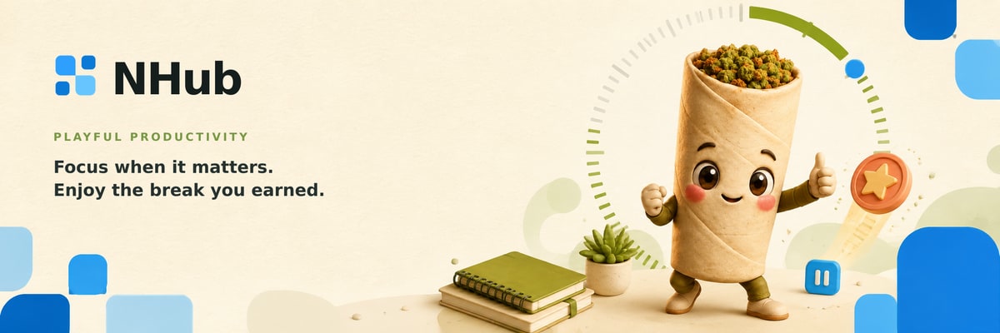
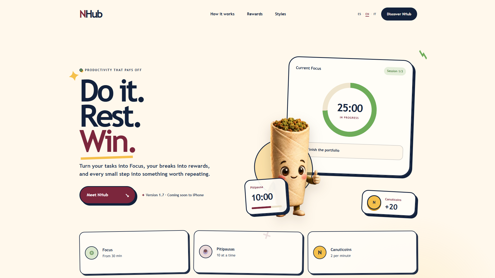
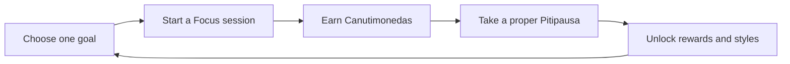
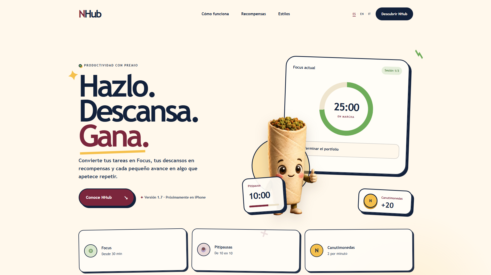
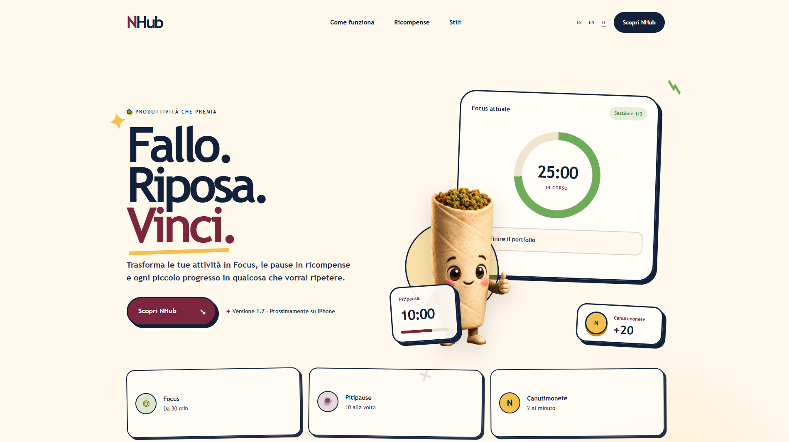

<p align="center">
  
</p>

<p align="center">
  <strong>Focus when it matters. Enjoy the break you earned.</strong><br>
  A productivity app where progress feels visible and Canutín keeps things playful.
</p>

<p align="center">
  <a href="https://nhub-app.pages.dev/"></a>
</p>

<p align="center">
  
  
  
  
  
</p>

<br>

[](https://nhub-app.pages.dev/)

## The NHub loop



## More than a timer

| 🎯 Focus | ☕ Pitipausas |
| --- | --- |
| Make starting easier and keep attention on one clear goal. | Give breaks a real place in the workflow instead of treating them as failure. |
| **🪙 Canutimonedas** | **🌱 Canutín** |
| Turn consistent effort into rewards you can see and use. | Add personality, accessories and a sense of progression to the whole experience. |

## See it in your language

<details>
<summary><strong>🇪🇸 Ver la presentación en español</strong></summary>

[](https://nhub-app.pages.dev/)

</details>

<details>
<summary><strong>🇮🇹 Guarda la presentazione in italiano</strong></summary>

[](https://nhub-app.pages.dev/)

</details>

## This repository

This is NHub's **public landing page**, built to present the product without exposing the mobile application's source code.

- Interactive Focus demo
- Tasks, breaks and reward-system previews
- Canutín accessories and visual styles
- Responsive desktop and mobile layouts
- English, Spanish and Italian content

## Run locally

Node.js **22.13 or newer** is recommended.

```bash
npm install
npm run dev
```

Build the static site:

```bash
npm run build
```

The result is written to `dist/` and deployed on Cloudflare Pages.

## Project status

- [x] Public multilingual landing page
- [x] Interactive Focus demo
- [x] Responsive layout
- [ ] Mobile app release

> NHub is in active development. The site evolves alongside the app rather than pretending everything is finished.
